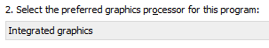

### If you tried everything in this guide and are still having issues, please make a post on the [forums](https://obsproject.com/forum) or stop by the [OBS Discord server](https://obsproject/discord).

***

## GPU selection for NVIDIA based laptops

* This guide will show you how to select the graphics card OBS is running on using the native control panel from NVIDIA.
* It is valid if you are running Windows 7, Windows 8 or Windows 10 up to version 1903.
* If you run Windows 10 1903 or newer, use [this guide](Laptop-GPU-Selection-Windows-10) instead.

***

## Setup

* Close OBS if it is currently open
* Go to the NVIDIA Control Panel by right clicking on your desktop, and then clicking on "NVIDIA Control Panel"

* Click on "Manage 3D Settings" if it is not already selected

* Under the Program Settings tab, click the "Add" button under where it says "Select a program to customize:"

* click "Browse" at bottom of the dialog to search for OBS

* Navigate to the .exe path for OBS and add it to the list. Default paths are:
  - 64-bit OBS (default): `C:\Program Files\obs-studio\bin\64bit\obs64.exe`
  - 32-bit OBS: `C:\Program Files (x86)\obs-studio\bin\32bit\obs32.exe`
* Make sure it is selected in the drop down list

* Then below, look for "Select the preferred graphics processor for this program". Then set the option, depending on which mode you need:

## For Display Capture

* Choose "Integrated Graphics. Close the control panel and start OBS.

## For Window Capture / Game Capture

* Choose "High performance NVIDIA processor". Close the control panel and start OBS.

