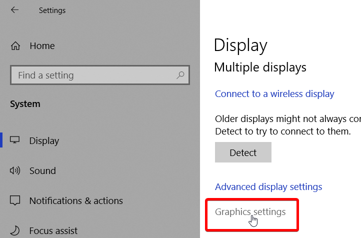
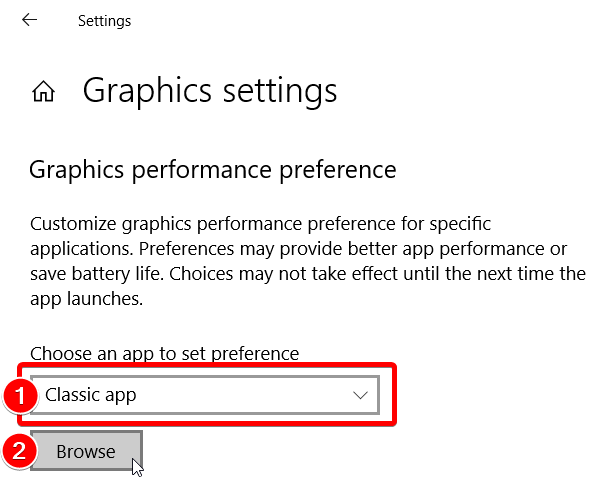
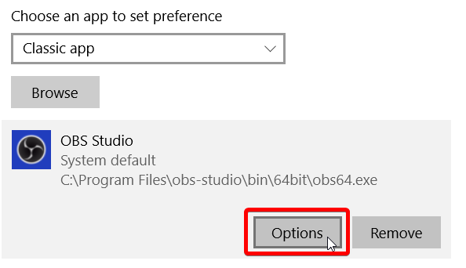
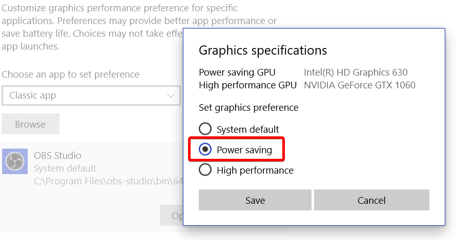
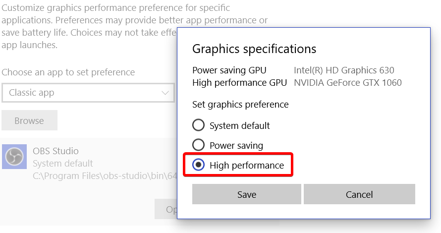

### If you tried everything in this guide and are still having issues, please make a post on the [forums](https://obsproject.com/forum) or stop by the [OBS Discord server](https://obsproject/discord).

***

When using OBS on a laptop or multi-GPU system, you may run into performance issues or issues using a specific capture type (i.e. Game or Window capture). This can be very frustrating. The reason this happens is because most modern laptops will come with two GPUs:

- An Intel GPU for 2D applications/your desktop
- A discrete graphics chip (either NVIDIA or AMD) for 3D apps and games.

OBS can only run on one of these GPUs, but your open applications and games could be running on either. For example, if OBS is running on the Intel GPU, you will not be able to use Game Capture for your games running on the discrete (NVIDIA or AMD) GPU. Additionally, if OBS is not running on the discrete GPU, you might run into performance issues. In rare cases, trying to capture a game running on a different GPU than OBS can cause the game to crash. This is not really an issue with OBS, but rather a design choice by laptop manufacturers in order to save power and there's little that can be done on our side. However, we do have several troubleshooting suggestions to try and assist with any issues.

***

## Setup

* Open the Windows 10 Settings App
* Navigate to System -> Display and select "Graphics settings" near the bottom

* Select "Classic app" and click "Browse" under Graphics performance preference

* Navigate and find your OBS Studio executable. By default this is `C:\Program Files\obs-studio\bin\64bit\obs64.exe`
* Once selected, click "Options" under the OBS Studio entry

Then follow the steps below, depending on which mode you need.

## For Display Capture

* Choose "Power saving" and click Save

## For Window Capture / Game Capture

* Choose "High performance" and click Save

